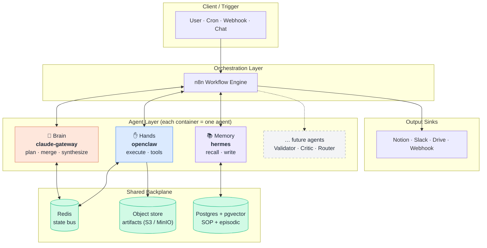
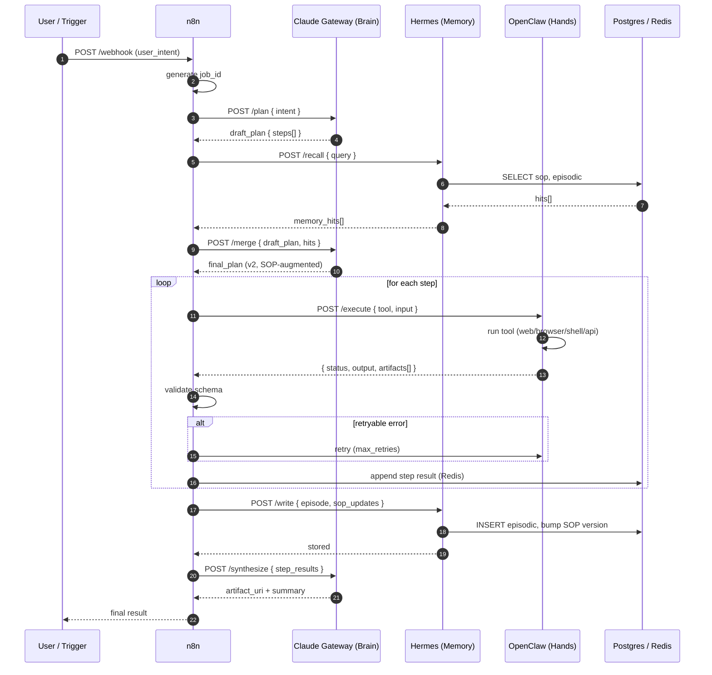
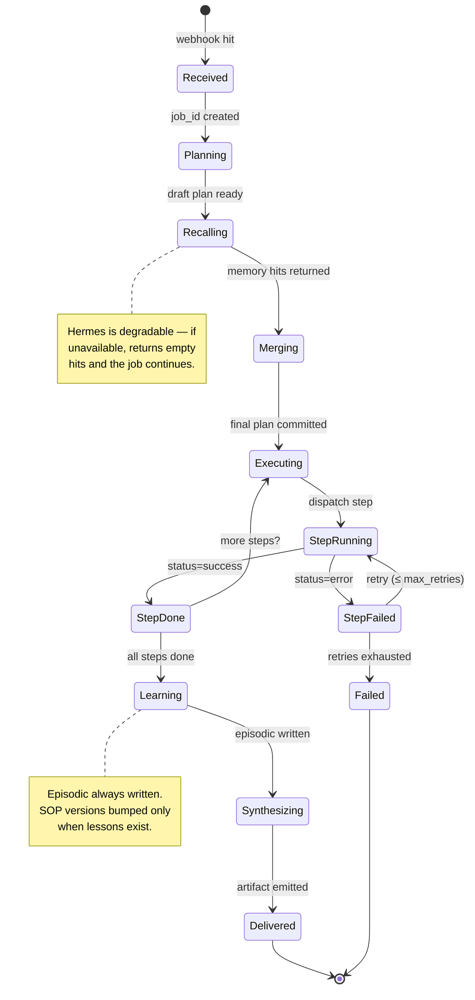

# Gateforge-Loom

> **Weave intelligent agents into workflows.**
> A composable, multi-agent orchestration stack — every agent is its own Docker container, every interaction is a JSON contract, every run leaves a memory.

[](LICENSE)


Gateforge-Loom is a **layered multi-agent system** built on three foundational
roles — **Brain · Hands · Memory** — orchestrated by **n8n** and connected
through **Redis** + **Postgres/pgvector**. The architecture treats agents as
threads on a loom: today three threads, tomorrow as many as your workflow
needs. New agents (Validator, Critic, Router, Reviewer…) drop in as additional
containers; the orchestrator weaves them all into one cohesive run.

---

## Table of contents

- [Why Gateforge-Loom?](#why-gateforge-loom)
- [Architecture at a glance](#architecture-at-a-glance)
- [Concept diagram](#1-concept-diagram)
- [Sequence diagram](#2-sequence-diagram-one-job-end-to-end)
- [State diagram](#3-state-diagram-job-lifecycle)
- [Workflow diagram](#4-workflow-diagram-the-n8n-pipeline)
- [Components](#components)
- [Quick start](#quick-start)
- [VM deployment](#vm-deployment)
- [Adding more agents](#adding-more-agents)
- [Project layout](#project-layout)
- [Roadmap](#roadmap)

---

## Why Gateforge-Loom?

> *"The three tools aren't competing — they're layered. Brain decides, Hands act, Memory remembers."*

Most multi-agent demos collapse three concerns into one prompt soup: planning,
execution, and memory all happen inside a single LLM call. That works for
toys; it does not survive production. Gateforge-Loom enforces **single
responsibility per layer**:

| Layer | Container | Owns | Never does |
|---|---|---|---|
| **Brain** | `claude-gateway` | Decisions, plans, synthesis | Side effects, I/O |
| **Hands** | `openclaw` | Tool execution, I/O, automation | Strategy, judgement |
| **Memory** | `hermes` | Recall, learn, distil SOPs | Initiate actions |
| **Bus** | `redis` | Job state, locks, cache | Long-term storage |
| **Storage** | `postgres + pgvector` | Episodic + SOP memory | Real-time state |
| **Orchestrator** | `n8n` | Sequencing, retries, fan-out | Anything an agent should do |

Each lives in its own Docker container, exposes a small typed API, and can be
upgraded, scaled, or replaced independently.

---

## Architecture at a glance

```
            ┌──────────────────────────────────────────────────────┐
            │               n8n  (orchestrator)                     │
            └────────────┬───────────────┬────────────┬─────────────┘
                         │               │            │
              POST /plan │     POST /recall │ POST /execute
                         ▼               ▼            ▼
                ┌────────────┐  ┌────────────┐  ┌────────────┐
                │ claude-gw  │  │  hermes    │  │  openclaw  │
                │  (Brain)   │  │ (Memory)   │  │  (Hands)   │
                └─────┬──────┘  └─────┬──────┘  └─────┬──────┘
                      │               │               │
                      ▼               ▼               ▼
                ┌────────────┐  ┌────────────┐  ┌────────────┐
                │ Anthropic  │  │ Postgres + │  │  Redis bus │
                │  (later)   │  │  pgvector  │  │   + tools  │
                └────────────┘  └────────────┘  └────────────┘
```

Every component runs as an independent container on a single VM (or split
across VMs over Tailscale).

---

## 1. Concept diagram

How the layers relate. Read top-to-bottom: a request enters at the
orchestrator, fans out to the agents, agents talk to the shared backplane,
results are woven back into a final artifact.



**Key idea.** Agents never call each other directly. Everything is mediated
by n8n (control flow) and the shared backplane (state). This is what lets
you add or remove agents without rewriting the others.

---

## 2. Sequence diagram (one job, end-to-end)

What actually happens when a request comes in. Notice that **memory is
queried before the plan is finalized**, and **memory is updated after every
successful run** — that's how the system gets faster over time.



---

## 3. State diagram (job lifecycle)

Every job moves through a small, predictable set of states. State transitions
are written to Redis under `job:{job_id}:state` so any agent or operator can
inspect a job in flight.



---

## 4. Workflow diagram (the n8n pipeline)

The actual node graph implemented in
[`n8n/workflows/gateforge-loom-pipeline.json`](n8n/workflows/gateforge-loom-pipeline.json).
Import it directly in n8n.

```mermaid
flowchart LR
    T([🪝 Webhook Trigger]) --> J[Generate job_id]
    J --> P1[Claude /plan]
    P1 --> R1[Hermes /recall]
    R1 --> M1[Claude /merge]
    M1 --> SP[Split steps]
    SP --> EX[OpenClaw /execute]
    EX --> V{Validate<br/>schema}
    V -- retryable error --> EX
    V -- ok --> AGG[Aggregate results]
    AGG -- more steps --> SP
    AGG -- done --> W[Hermes /write]
    W --> SY[Claude /synthesize]
    SY --> OUT([📤 Output sink])

    classDef trigger fill:#FECACA,stroke:#DC2626;
    classDef brain   fill:#FEE7DC,stroke:#D97757;
    classDef hands   fill:#DBEAFE,stroke:#3B82F6;
    classDef memory  fill:#EDE9FE,stroke:#8B5CF6;
    classDef ctrl    fill:#F3F4F6,stroke:#6B7280;
    classDef out     fill:#FEF3C7,stroke:#F59E0B;

    class T trigger
    class P1,M1,SY brain
    class EX hands
    class R1,W memory
    class J,SP,V,AGG ctrl
    class OUT out
```



| # | Node | Type | Purpose |
|---|---|---|---|
| 1 | **Webhook Trigger** | Webhook | Entry point. Accepts `{ user_intent, context }`. |
| 2 | **Generate job_id** | Code | Deterministic ID for tracing. |
| 3 | **Claude /plan** | HTTP | Decompose intent → step list. |
| 4 | **Hermes /recall** | HTTP | Pull relevant SOP + episodic memories. |
| 5 | **Claude /merge** | HTTP | Fold memory into final plan (v2). |
| 6 | **Split steps** | Split-Out | One iteration per plan step. |
| 7 | **OpenClaw /execute** | HTTP | Run a single tool invocation. |
| 8 | **Validate** | Code | JSON-schema check + retryable error detection. |
| 9 | **Aggregate** | Merge | Collect step results into Redis. |
| 10 | **Hermes /write** | HTTP | Persist episodic memory + SOP patches. |
| 11 | **Claude /synthesize** | HTTP | Final report artifact. |
| 12 | **Output sink** | Notion / Slack / Drive | Deliver to the user. |

---

## Components

Each component is **one Docker container**. Read
[`docs/components.md`](docs/components.md) for the deep dive; quick summary
below.

### 🧠 `claude-gateway` (Brain)

- **Image:** `gateforge-loom/claude-gateway` (Python 3.12 + FastAPI)
- **Port:** 8001 (host) → 8000 (container)
- **Endpoints:** `GET /health`, `POST /plan`, `POST /merge`, `POST /synthesize`
- **Job:** thin wrapper around an LLM (Anthropic by default; pluggable). Owns
  *all* reasoning. Returns structured JSON only — never executes side
  effects.
- **Stub mode:** `STUB_MODE=1` returns canned plans so you can wire the full
  pipeline before adding API keys.

### ✋ `openclaw` (Hands)

- **Image:** `gateforge-loom/openclaw` (Python 3.12 + FastAPI)
- **Port:** 8002 → 8000
- **Endpoints:** `GET /health`, `GET /tools`, `POST /execute`
- **Job:** runs one plan step against one registered tool. Built-in tool
  catalogue covers `web.fetch`, `browser.action`, `shell.run`, `api.call`.
  Failures are explicit (`status=error`, `retryable` flag) — n8n decides
  whether to retry.
- **Sandboxing:** ships rootless; mount tool-specific volumes only.

### 📚 `hermes` (Memory)

- **Image:** `gateforge-loom/hermes` (Python 3.12 + FastAPI + psycopg)
- **Port:** 8003 → 8000
- **Endpoints:** `GET /health`, `POST /recall`, `POST /write`
- **Job:** vector-search SOP & episodic memories on `/recall`; persist
  episode + bump SOP versions on `/write`. Uses Postgres `vector(1536)`
  columns; ready to plug in any embedding provider.
- **Degradable:** if Postgres is down, `/recall` returns empty hits so the
  rest of the pipeline keeps running.

### 🚌 `redis` (State bus)

- **Image:** `redis:7-alpine`
- **Port:** 6379
- **Job:** distributed state for in-flight jobs. Keys follow a strict
  convention so any agent can debug a job:
  ```
  job:{job_id}:state
  job:{job_id}:plan
  job:{job_id}:step:{step_id}
  job:{job_id}:cursor
  job:{job_id}:lock
  ```
- TTL: 7 days for active job keys; persisted via AOF.

### 🗄 `postgres` (Long-term memory)

- **Image:** `pgvector/pgvector:pg16`
- **Port:** 5432
- **Job:** durable storage for `episodic_memory` and `sop` tables. Schema
  initialised by [`infra/postgres/init.sql`](infra/postgres/init.sql) on
  first boot — includes one seed SOP so `/recall` returns data on day 1.
- **Indexes:** B-tree on intent + created_at; ivfflat on `embedding` once
  data exists.

### 🎼 `n8n` (Orchestrator)

- **Image:** `n8nio/n8n:latest`
- **Port:** 5678
- **Job:** owns control flow — sequencing, retries, fan-out, output sinks.
  The only externally-exposed UI; everything else lives behind it on
  `loomnet`.
- **Imports:** `n8n/workflows/gateforge-loom-pipeline.json` is mounted
  read-only into the container at `/workflows`.

---

## Quick start

```bash
git clone https://github.com/tonylnng/gateforge-loom.git
cd gateforge-loom
cp .env.example .env             # fill in passwords + tokens
make up                          # build + start everything
make health                      # hit every /health endpoint
make test                        # end-to-end smoke test
```

Then open <http://localhost:5678> (n8n) and import
`n8n/workflows/gateforge-loom-pipeline.json`.

---

## VM deployment

Gateforge-Loom is designed for a **single Linux VM** (Ubuntu 22.04 LTS
recommended) with Docker Engine + Docker Compose v2. See
[`docs/deployment.md`](docs/deployment.md) for the full guide. Headlines:

- **Minimum VM:** 2 vCPU, 4 GB RAM, 30 GB disk for stub mode + light usage.
- **Recommended:** 4 vCPU, 8 GB RAM, 80 GB disk if running live LLM calls
  + Playwright browsers inside OpenClaw.
- **Networking:** only port `5678` (n8n) needs to be public; everything else
  is reachable on `loomnet` only. Optionally expose 8001-8003 over Tailscale
  for local dev access.
- **Secrets:** managed via `.env` on disk (mode `600`) or systemd
  `EnvironmentFile`. Rotate `INTERNAL_API_TOKEN` and `N8N_ENCRYPTION_KEY`
  before going to staging.
- **Backups:** snapshot the `postgres-data` and `n8n-data` volumes nightly.
  Redis is stateful but recoverable — episodic memory is the only durable
  asset.

---

## Adding more agents

The whole point of the loom metaphor: more threads, same machine.

1. **Scaffold a new service** — copy `services/openclaw/` to
   `services/<your-agent>/`, rename the FastAPI app, define endpoints.
2. **Add a Compose block** — append a new service in `docker-compose.yml`
   with `networks: [loomnet]` and a `/health` healthcheck.
3. **Register tools (optional)** — if it's an executor, expose a `GET
   /tools` manifest so Claude can discover its capabilities.
4. **Add an n8n node** — drop an HTTP Request node in the workflow at the
   right point. Reroute connections.
5. **Update docs** — add a row to the components table here and a section
   in `docs/components.md`.

Examples of agents that fit naturally:

| Agent | Role | Where in workflow |
|---|---|---|
| **Validator** | Schema-check tool outputs | between OpenClaw and Aggregate |
| **Critic** | Score plans before execution | between `/merge` and `Split` |
| **Router** | Pick which executor for a step | inside `Split steps` |
| **Reviewer** | Human-in-the-loop approval | before `Output sink` |
| **Embedder** | Compute embeddings for Hermes | called by `/write` |

---

## Project layout

```
gateforge-loom/
├── README.md                  # this file
├── Makefile                   # up · down · health · test · clean · nuke
├── docker-compose.yml         # full stack
├── .env.example
├── docs/
│   ├── components.md          # per-component deep dive
│   ├── api-contract.md        # endpoint reference
│   ├── deployment.md          # VM bring-up, hardening, backups
│   └── architecture.md        # design decisions + extension points
├── infra/postgres/init.sql    # pgvector + tables + seed SOP
├── n8n/workflows/             # importable workflow JSON
├── schemas/                   # JSON Schemas for tool I/O
├── scripts/                   # health + smoke-test
└── services/
    ├── claude-gateway/        # 🧠 Brain
    ├── openclaw/              # ✋ Hands
    └── hermes/                # 📚 Memory
```

---

## Roadmap

- [x] Phase 1 — stub services + n8n wiring + smoke test
- [ ] Phase 2 — wire real Anthropic API in `claude-gateway` (structured tool use)
- [ ] Phase 3 — Playwright tool inside `openclaw`
- [ ] Phase 4 — real embeddings in `hermes` (voyage-3 or text-embedding-3-small)
- [ ] Phase 5 — Validator + Critic agents
- [ ] Phase 6 — multi-tenant (`tenant_id` everywhere) + per-job cost guardrails
- [ ] Phase 7 — Helm chart for OpenShift / Kubernetes deployment

---

## License

MIT. See [LICENSE](LICENSE).

---

*Designed and maintained by [@tonylnng](https://github.com/tonylnng).
Inspired by the "三個工具不是在競爭,而是在分層" framing — Brain, Hands,
and Memory don't replace each other, they layer.*
