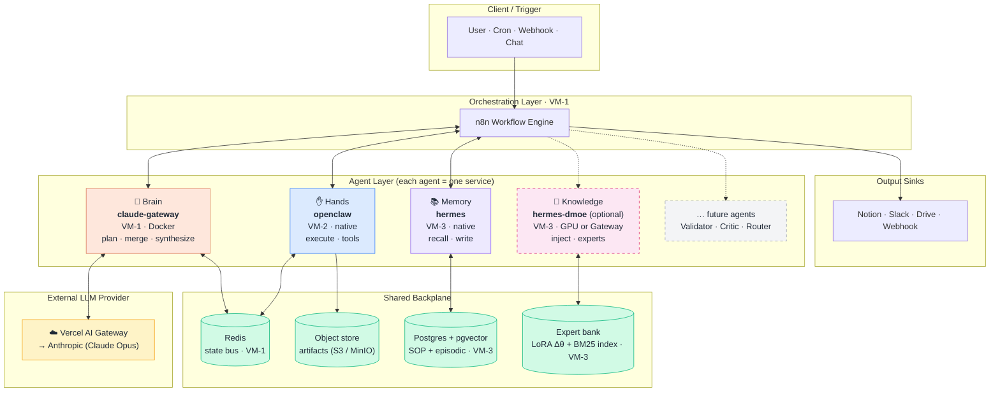
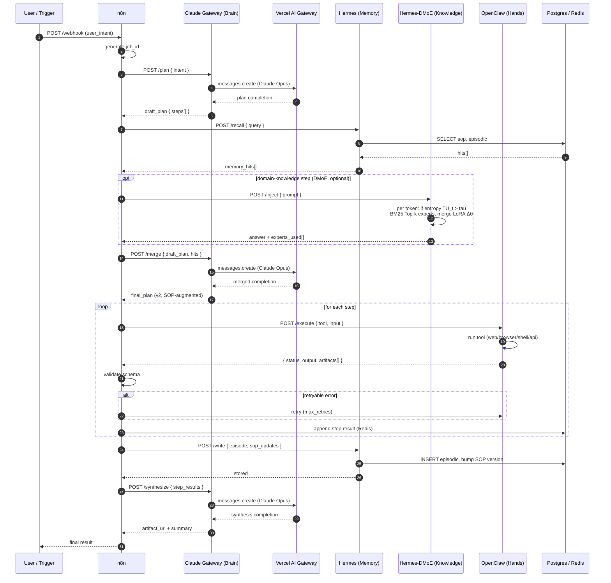
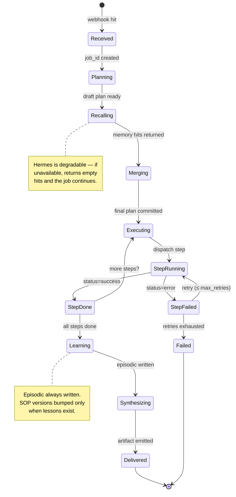
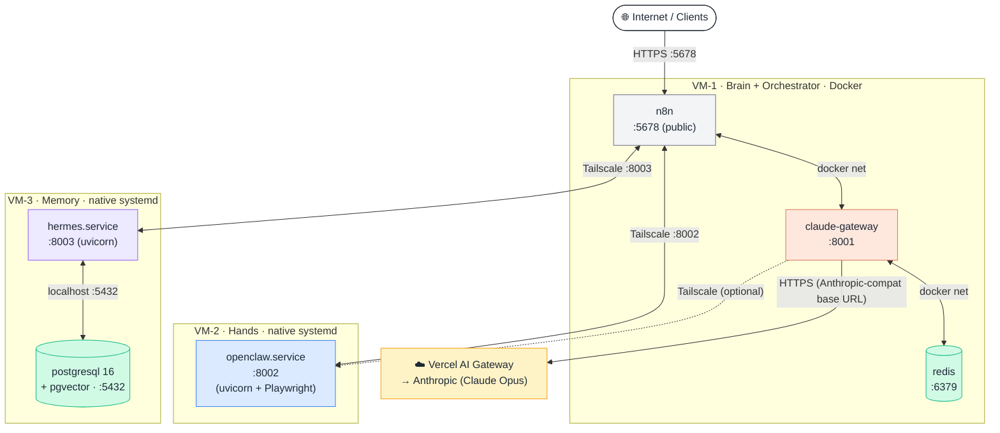
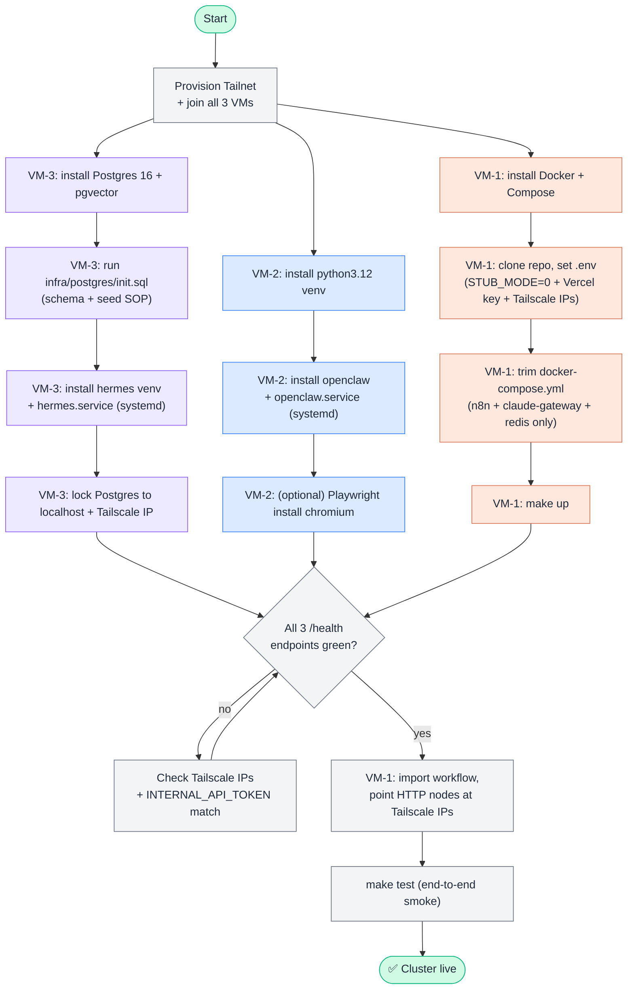
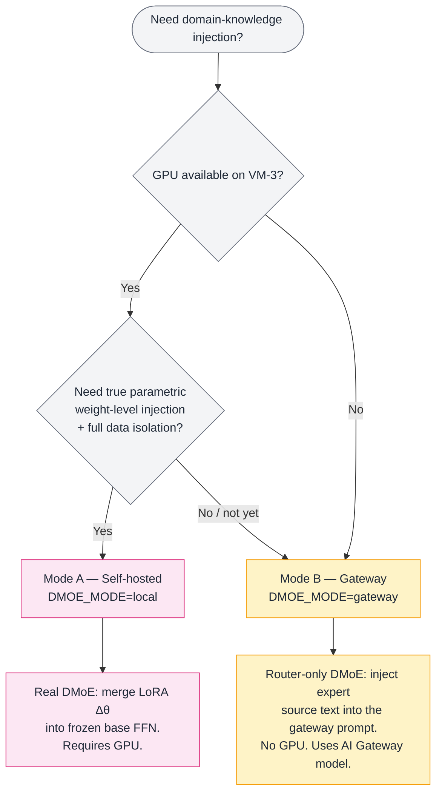
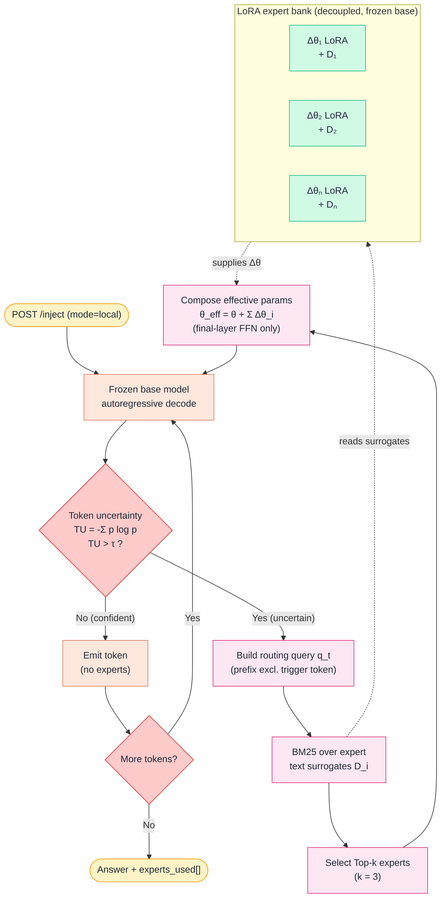
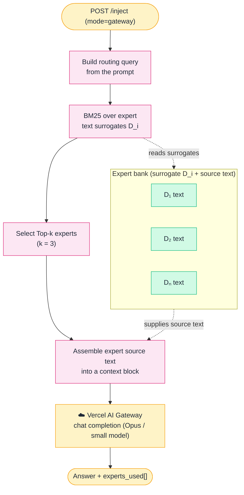

# Gateforge-Loom

> **Weave intelligent agents into workflows.**
> A composable, multi-agent orchestration stack — every agent is its own service, every interaction is a JSON contract, every run leaves a memory.

[](LICENSE)


Gateforge-Loom is a **layered multi-agent system** built on three foundational
roles — **Brain · Hands · Memory** — orchestrated by **n8n** and connected
through **Redis** + **Postgres/pgvector**. The architecture treats agents as
threads on a loom: today three threads, tomorrow as many as your workflow
needs. New agents (Validator, Critic, Router, Reviewer…) drop in as additional
services; the orchestrator weaves them all into one cohesive run.

The stack runs equally well on **a single VM with Docker** or on a **3-VM
hybrid topology** — Brain + Orchestrator in Docker on one VM, and Hands and
Memory installed **natively as systemd services** on two more VMs, meshed over
Tailscale. The Brain reaches Anthropic models through the **Vercel AI Gateway**,
which keeps it reachable from regions where `api.anthropic.com` is blocked
(e.g. Hong Kong).

---

## Table of contents

- [Why Gateforge-Loom?](#why-gateforge-loom)
- [Architecture at a glance](#architecture-at-a-glance)
- [Concept diagram](#1-concept-diagram)
- [Sequence diagram](#2-sequence-diagram-one-job-end-to-end)
- [State diagram](#3-state-diagram-job-lifecycle)
- [Workflow diagram](#4-workflow-diagram-the-n8n-pipeline)
- [Deployment diagram](#5-deployment-diagram-3-vm-hybrid-topology)
- [Install-flow diagram](#6-install-flow-diagram-cluster-bring-up)
- [DMoE diagram](#7-dmoe-diagram-parametric-knowledge-injection)
- [Components](#components)
- [Quick start](#quick-start)
- [Deployment topology](#deployment-topology)
- [VM-1 install — Brain + Orchestrator (Docker)](#vm-1-install--brain--orchestrator-docker)
- [VM-2 install — OpenClaw native (Hands)](#vm-2-install--openclaw-native-hands)
- [VM-3 install — Hermes native (Memory)](#vm-3-install--hermes-native-memory)
- [Backup & recovery](#backup--recovery)
- [Operations cheatsheet](#operations-cheatsheet)
- [Adding more agents](#adding-more-agents)
- [Project layout](#project-layout)
- [Roadmap](#roadmap)

---

## Why Gateforge-Loom?

> *"The three tools aren't competing — they're layered. Brain decides, Hands act, Memory remembers."*

Most multi-agent demos collapse three concerns into one prompt soup: planning,
execution, and memory all happen inside a single LLM call. That works for
toys; it does not survive production. Gateforge-Loom enforces **single
responsibility per layer**:

| Layer | Service | Owns | Never does | Where it runs |
|---|---|---|---|---|
| **Brain** | `claude-gateway` | Decisions, plans, synthesis | Side effects, I/O | VM-1 (Docker) |
| **Hands** | `openclaw` | Tool execution, I/O, automation | Strategy, judgement | VM-2 (native systemd) |
| **Memory** | `hermes` | Recall, learn, distil SOPs | Initiate actions | VM-3 (native systemd) |
| **Knowledge** | `hermes-dmoe` *(optional)* | Domain knowledge via DMoE — weight-level (GPU) **or** gateway prompt-level (no GPU) | Episodic recall, side effects | VM-3 (native; GPU for Mode A) |
| **Bus** | `redis` | Job state, locks, cache | Long-term storage | VM-1 (Docker) |
| **Storage** | `postgres + pgvector` | Episodic + SOP memory | Real-time state | VM-3 (native) |
| **Orchestrator** | `n8n` | Sequencing, retries, fan-out | Anything an agent should do | VM-1 (Docker) |
| **LLM Gateway** | `Vercel AI Gateway` | HK-reachable Anthropic proxy, failover, cost tracking | Any orchestration logic | External (Vercel edge) |

Each layer exposes a small typed API and can be upgraded, scaled, or replaced
independently — whether it runs as a container or a native service.

> **Optional Knowledge layer — `hermes-dmoe`.** An optional sibling to `hermes`
> that adds domain knowledge via **Decoupled Mixture-of-Experts (DMoE)**
> ([arXiv:2606.14243](https://arxiv.org/abs/2606.14243)). It runs in **two modes**
> sharing one expert bank + BM25 router: **Mode A (`local`)** self-hosts a small
> open base model and merges LoRA experts **into the weights** (true parametric
> DMoE, **needs a GPU**); **Mode B (`gateway`)** skips the GPU and instead feeds
> the router-selected expert text to a model behind the **Vercel AI Gateway**
> (prompt-level, **no GPU**). It is **not** on the default critical path —
> Brain/Hands/Memory work without it — and true parametric injection never
> applies to the closed-API Claude Brain. See the
> [DMoE diagram](#7-dmoe-diagram-parametric-knowledge-injection) and
> [`docs/references/README.md`](docs/references/README.md).

---

## Architecture at a glance

```
            ┌──────────────────────────────────────────────────────┐
            │               n8n  (orchestrator)                     │
            └────────────┬───────────────┬────────────┬─────────────┘
                         │               │            │
              POST /plan │     POST /recall │ POST /execute
                         ▼               ▼            ▼
                ┌────────────┐  ┌────────────┐  ┌────────────┐
                │ claude-gw  │  │  hermes    │  │  openclaw  │
                │  (Brain)   │  │ (Memory)   │  │  (Hands)   │
                └─────┬──────┘  └─────┬──────┘  └─────┬──────┘
                      │               │               │
                      ▼               ▼               ▼
                ┌────────────┐  ┌────────────┐  ┌────────────┐
                │ Vercel AI  │  │ Postgres + │  │  Redis bus │
                │  Gateway   │  │  pgvector  │  │   + tools  │
                │ → Anthropic│  │            │  │            │
                └────────────┘  └────────────┘  └────────────┘
```

Components can all run on a single VM, or split across three VMs over
Tailscale — see [Deployment topology](#deployment-topology).

---

## 1. Concept diagram

How the layers relate. Read top-to-bottom: a request enters at the
orchestrator, fans out to the agents, agents talk to the shared backplane,
results are woven back into a final artifact.



**Key idea.** Agents never call each other directly. Everything is mediated
by n8n (control flow) and the shared backplane (state). This is what lets
you add or remove agents without rewriting the others. The Brain's only
outbound dependency is the Vercel AI Gateway.

---

## 2. Sequence diagram (one job, end-to-end)

What actually happens when a request comes in. Notice that **memory is
queried before the plan is finalized**, **memory is updated after every
successful run** (that's how the system gets faster over time), and **every
Brain call round-trips through the Vercel AI Gateway** to reach Anthropic.



---

## 3. State diagram (job lifecycle)

Every job moves through a small, predictable set of states. State transitions
are written to Redis under `job:{job_id}:state` so any agent or operator can
inspect a job in flight.



---

## 4. Workflow diagram (the n8n pipeline)

The actual node graph implemented in
[`n8n/workflows/gateforge-loom-pipeline.json`](n8n/workflows/gateforge-loom-pipeline.json).
Import it directly in n8n.

```mermaid
flowchart LR
    T(["🪝 Webhook Trigger"]) --> J["Generate job_id"]
    J --> P1["Claude /plan"]
    P1 --> R1["Hermes /recall"]
    R1 --> KQ{"domain knowledge<br/>needed?"}
    KQ -- "yes (optional)" --> DM["Hermes-DMoE /inject"]
    KQ -- "no" --> M1
    DM --> M1["Claude /merge"]
    M1 --> SP["Split steps"]
    SP --> EX["OpenClaw /execute"]
    EX --> V{"Validate<br/>schema"}
    V -- "retryable error" --> EX
    V -- "ok" --> AGG["Aggregate results"]
    AGG -- "more steps" --> SP
    AGG -- "done" --> W["Hermes /write"]
    W --> SY["Claude /synthesize"]
    SY --> OUT(["📤 Output sink"])

    classDef trigger fill:#FECACA,stroke:#DC2626;
    classDef brain   fill:#FEE7DC,stroke:#D97757;
    classDef hands   fill:#DBEAFE,stroke:#3B82F6;
    classDef memory  fill:#EDE9FE,stroke:#8B5CF6;
    classDef know    fill:#FCE7F3,stroke:#DB2777,stroke-dasharray: 5 5;
    classDef ctrl    fill:#F3F4F6,stroke:#6B7280;
    classDef out     fill:#FEF3C7,stroke:#F59E0B;

    class T trigger
    class P1,M1,SY brain
    class EX hands
    class R1,W memory
    class DM know
    class J,SP,V,AGG,KQ ctrl
    class OUT out
```



| # | Node | Type | Purpose |
|---|---|---|---|
| 1 | **Webhook Trigger** | Webhook | Entry point. Accepts `{ user_intent, context }`. |
| 2 | **Generate job_id** | Code | Deterministic ID for tracing. |
| 3 | **Claude /plan** | HTTP | Decompose intent → step list. |
| 4 | **Hermes /recall** | HTTP | Pull relevant SOP + episodic memories. |
| 4a | **domain knowledge?** | If/Switch | Optional branch — route to DMoE only when the job needs baked-in domain knowledge. |
| 4b | **Hermes-DMoE /inject** *(optional)* | HTTP | Parametric knowledge injection (entropy trigger + BM25 Top-k LoRA experts). |
| 5 | **Claude /merge** | HTTP | Fold memory into final plan (v2). |
| 6 | **Split steps** | Split-Out | One iteration per plan step. |
| 7 | **OpenClaw /execute** | HTTP | Run a single tool invocation. |
| 8 | **Validate** | Code | JSON-schema check + retryable error detection. |
| 9 | **Aggregate** | Merge | Collect step results into Redis. |
| 10 | **Hermes /write** | HTTP | Persist episodic memory + SOP patches. |
| 11 | **Claude /synthesize** | HTTP | Final report artifact. |
| 12 | **Output sink** | Notion / Slack / Drive | Deliver to the user. |

---

## 5. Deployment diagram (3-VM hybrid topology)

The physical placement of every component. **VM-1** runs the Brain +
Orchestrator + state bus in Docker; **VM-2** and **VM-3** run the agents as
**native systemd services** (no Docker). All cross-VM traffic flows over a
Tailscale mesh; only n8n's UI (`5678`) is public-facing.



| VM | Runs | Runtime | Public port | Tailscale ports |
|---|---|---|---|---|
| **VM-1** | n8n · claude-gateway · redis | Docker Compose | `5678` (n8n UI) | `8001`, `6379` (internal) |
| **VM-2** | openclaw | native systemd | — | `8002` |
| **VM-3** | hermes · postgres+pgvector | native systemd | — | `8003`, `5432` |

> The Gateforge-Loom contract is **transport-agnostic** — agents talk via JSON
> over HTTP with `INTERNAL_API_TOKEN` auth. Whether an agent runs as a Docker
> container or a native systemd service is invisible to n8n and the Brain.

---

## 6. Install-flow diagram (cluster bring-up)

The order of operations to stand up the cluster from scratch. Color-coded per
VM. Provision the Tailnet first so every VM can resolve the others before you
wire `.env` files.



---

## 7. DMoE diagram (parametric knowledge injection)

*Optional Knowledge layer.* Where `hermes` retrieves facts **into the prompt**,
`hermes-dmoe` adds domain knowledge using the **Decoupled Mixture-of-Experts**
recipe ([arXiv:2606.14243](https://arxiv.org/abs/2606.14243)): a **training-free
BM25 router** over a bank of per-knowledge-unit experts, fired **only when the
model is uncertain** (token-entropy `TU_t = -Σ p_t(v) log p_t(v) > τ`,
default `τ = 2.0`).

`hermes-dmoe` ships in **two runtime modes** that share the same expert bank,
the same BM25 router, and the same `POST /inject` API contract — only the
*injection mechanism* differs. Pick one at setup time with the `DMOE_MODE`
env var.

### Which mode? (pick at setup)



### Mode A — self-hosted (true parametric DMoE, needs GPU)

The paper's method exactly: a **frozen** small open base model (Llama-3.2-1B /
Qwen2.5-1.5B) on VM-3, with the BM25 router merging the selected LoRA deltas
into the final-layer FFN **inside the decode loop**. Requires reading per-token
logits and mutating weights — hence a **GPU and self-hosting are mandatory**.



**Why this shape.** Each knowledge unit is one small LoRA adapter (rank 4,
α = 16, ~481 KiB) attached **only to the final-layer FFN** — so the KV-cache is
preserved and adapters compose additively. Because injection is entropy-gated,
most tokens decode at full base-model speed; the paper reports ~3× faster and
~1.6–1.9× less GPU than token-level RAG baselines like FLARE.

### Mode B — gateway (router-only, no GPU)

When VM-3 has **no GPU**, reuse the *same* expert bank and BM25 router but swap
the injection mechanism: instead of merging weights, retrieve the Top-k experts'
**source text `D_i`** and pass it as **prompt context** to a model behind the
**Vercel AI Gateway** (the same HK-reachable provider the Brain uses). This is
**not** true weight-level DMoE — it is router-driven, expert-scoped
retrieval-augmentation — but it needs **no GPU and no self-hosted model**, and
keeps the identical `/inject` contract and expert lifecycle.



### Mode comparison

| | **Mode A — `local`** | **Mode B — `gateway`** |
|---|---|---|
| Injection level | **Parametric** (LoRA Δθ merged into weights) | **Prompt-level** (expert source text in context) |
| True DMoE per the paper | Yes | Router-only approximation |
| GPU on VM-3 | **Required** | **Not needed** |
| Model | Self-hosted Llama-3.2-1B / Qwen2.5-1.5B | AI Gateway model (Claude Opus / small) |
| Entropy trigger `TU > τ` | Per-token (real logits) | N/A (single gateway call) |
| Data isolation | Knowledge stays on-VM in weights | Expert text sent to the gateway provider |
| Ops weight | Heaviest (GPU box + LoRA training) | Lightest (CPU + API key) |
| Best when | Air-gapped / on-prem, latency-sensitive, want the real method | No GPU, fast PoC, knowledge isn't provider-sensitive |

**Shared across both modes.** Each knowledge unit is built once (1 paraphrase +
3 generated Q&A pairs), indexed in BM25 by its surrogate `D_i`, and managed
through the same `/experts/upsert` + `DELETE /experts/{id}` lifecycle. Switching
mode is a single `DMOE_MODE` env flip — the expert bank is reused as-is.

> **Boundary (both modes).** True parametric DMoE applies to the **self-hosted**
> base model only — never the Claude Brain (closed API, no weights). And
> **PHI / regulated data stays in `hermes`** (retrievable and redactable); it is
> never baked into a LoRA expert (Mode A) nor sent to the gateway (Mode B),
> where it could not be cleanly deleted.

---

## Components

Quick summary below; read [`docs/components.md`](docs/components.md) for the
deep dive. The **runtime** column reflects the 3-VM hybrid topology.

### 🧠 `claude-gateway` (Brain) — VM-1, Docker

- **Image:** `gateforge-loom/claude-gateway` (Python 3.12 + FastAPI)
- **Port:** 8001 (host) → 8000 (container)
- **Endpoints:** `GET /health`, `POST /plan`, `POST /merge`, `POST /synthesize`
- **Job:** thin wrapper around an LLM. Owns *all* reasoning. Returns structured
  JSON only — never executes side effects.
- **LLM routing:** reaches Anthropic through the **Vercel AI Gateway** via an
  Anthropic-compatible base URL, so it stays reachable from HK. Set
  `ANTHROPIC_BASE_URL=https://ai-gateway.vercel.sh/v1/anthropic`,
  `ANTHROPIC_API_KEY=<vercel-gateway-key>`, and `CLAUDE_MODEL` to an Opus model.
- **Stub mode:** `STUB_MODE=1` returns canned plans so you can wire the full
  pipeline before adding API keys; set `STUB_MODE=0` for live calls.

### ✋ `openclaw` (Hands) — VM-2, native systemd

- **Runtime:** Python 3.12 venv under `/opt/openclaw`, run by `openclaw.service`
- **Port:** 8002
- **Endpoints:** `GET /health`, `GET /tools`, `POST /execute`
- **Job:** runs one plan step against one registered tool. Built-in tool
  catalogue covers `web.fetch`, `browser.action`, `shell.run`, `api.call`.
  Failures are explicit (`status=error`, `retryable` flag) — n8n decides
  whether to retry.
- **Sandboxing:** systemd hardening (`ProtectSystem=strict`, `NoNewPrivileges`,
  `PrivateTmp`); Playwright/Chromium installed in the venv for `browser.action`.

### 📚 `hermes` (Memory) — VM-3, native systemd

- **Runtime:** Python 3.12 venv under `/opt/hermes`, run by `hermes.service`
- **Port:** 8003
- **Endpoints:** `GET /health`, `POST /recall`, `POST /write`
- **Job:** vector-search SOP & episodic memories on `/recall`; persist episode
  + bump SOP versions on `/write`. Uses Postgres `vector(1536)` columns.
- **Degradable:** if Postgres is down, `/recall` returns empty hits so the
  rest of the pipeline keeps running.

### 🧬 `hermes-dmoe` (Knowledge, optional) — VM-3, native

- **Runtime:** Python 3.12 venv under `/opt/hermes-dmoe`, run by
  `hermes-dmoe.service`, co-located with `hermes` on VM-3.
- **Port:** 8004
- **Endpoints:** `GET /health`, `GET /experts`, `POST /inject`,
  `POST /experts/upsert`, `DELETE /experts/{id}`
- **Two runtime modes (set `DMOE_MODE`):**
  - **`local` — true parametric DMoE (needs GPU).** Self-hosts a small open base
    model (Llama-3.2-1B / Qwen2.5-1.5B); when token entropy `TU_t > τ` it routes
    via BM25 to the Top-k experts and **merges their LoRA Δθ into the final-layer
    FFN**. This is the paper's method.
  - **`gateway` — router-only (no GPU).** Reuses the same expert bank + BM25
    router, but injects the selected experts' **source text as prompt context**
    to a model behind the **Vercel AI Gateway**. No GPU, no self-hosted model;
    same `/inject` contract. Approximation, not weight-level DMoE.
- **Optional + degradable:** off the default critical path — if absent or down,
  the pipeline runs on Brain/Hands/Memory alone. True parametric injection does
  **not** apply to the Claude Brain (closed API). Keep PHI/regulated data in
  `hermes`, not in experts (and not sent to the gateway).
- See [`docs/components.md`](docs/components.md#-hermes-dmoe--knowledge-dmoe) and
  [`docs/api-contract.md`](docs/api-contract.md#knowledge--hermes-dmoe-port-8004).

### 🚌 `redis` (State bus) — VM-1, Docker

- **Image:** `redis:7-alpine`
- **Port:** 6379
- **Job:** distributed state for in-flight jobs. Keys follow a strict
  convention so any agent can debug a job:
  ```
  job:{job_id}:state
  job:{job_id}:plan
  job:{job_id}:step:{step_id}
  job:{job_id}:cursor
  job:{job_id}:lock
  ```
- TTL: 7 days for active job keys; persisted via AOF.

### 🗄 `postgres` (Long-term memory) — VM-3, native

- **Package:** `postgresql-16` + `postgresql-16-pgvector`
- **Port:** 5432 (bound to localhost + Tailscale IP only)
- **Job:** durable storage for `episodic_memory` and `sop` tables. Schema
  initialised by [`infra/postgres/init.sql`](infra/postgres/init.sql) —
  includes one seed SOP so `/recall` returns data on day 1.
- **Indexes:** B-tree on intent + created_at; ivfflat on `embedding` once
  data exists.

### 🎼 `n8n` (Orchestrator) — VM-1, Docker

- **Image:** `n8nio/n8n:latest`
- **Port:** 5678 (the only public-facing UI)
- **Job:** owns control flow — sequencing, retries, fan-out, output sinks.
- **Imports:** `n8n/workflows/gateforge-loom-pipeline.json`. After import,
  point the Hermes/OpenClaw HTTP nodes at the **Tailscale IPs** of VM-3/VM-2.

### ☁️ `Vercel AI Gateway` (LLM provider) — external

- **Endpoint:** `https://ai-gateway.vercel.sh/v1/anthropic` (Anthropic-compatible)
- **Job:** proxies Brain calls to Claude Opus, reachable from regions where
  `api.anthropic.com` is blocked. Adds provider failover and cost tracking in
  the Vercel dashboard. The `claude-gateway` code is unchanged except for the
  `base_url` it points at.

---

## Quick start

For a fast local PoC, everything still runs on **one VM** with Docker:

```bash
git clone https://github.com/tonylnng/gateforge-loom.git
cd gateforge-loom
cp .env.example .env             # fill in passwords + tokens
make up                          # build + start everything
make health                      # hit every /health endpoint
make test                        # end-to-end smoke test
```

Then open <http://localhost:5678> (n8n) and import
`n8n/workflows/gateforge-loom-pipeline.json`.

For the production **3-VM hybrid** layout, follow the per-VM install sections
below.

---

## Deployment topology

```
                ┌─────────────────────────────────┐
                │  VM-1: Brain + Orchestrator      │
                │  (Docker)                        │
                │  - n8n         :5678  (public)   │
                │  - claude-gw   :8001             │──→ Vercel AI Gateway
                │  - redis       :6379             │    (Anthropic-compat base URL)
                └────────┬────────────────┬────────┘
                         │  Tailscale     │
                         ▼                ▼
              ┌──────────────┐    ┌────────────────┐
              │  VM-2 (native)│    │  VM-3 (native) │
              │  - openclaw   │    │  - hermes      │
              │    (systemd)  │    │  - postgres    │
              │  :8002        │    │    + pgvector  │
              └──────────────┘    │  :8003  :5432  │
                                  └────────────────┘
```

| Resource | VM-1 (Brain+Orch) | VM-2 (Hands) | VM-3 (Memory) |
|---|---|---|---|
| **OS** | Ubuntu 22.04 LTS | Ubuntu 22.04 LTS | Ubuntu 22.04 LTS |
| **vCPU** | 4 | 2 (4 with Playwright) | 2 |
| **RAM** | 8 GB | 4 GB (8 GB w/ browsers) | 4 GB |
| **Disk** | 80 GB SSD | 40 GB SSD | 80 GB SSD (DB growth) |
| **Runtime** | Docker Compose | native systemd | native systemd |
| **Public port** | 5678 | none | none |

All three VMs share one `INTERNAL_API_TOKEN` and live on the same Tailnet.
Pick a region close to the Vercel AI Gateway edge (HK / Singapore / Tokyo).

---

## VM-1 install — Brain + Orchestrator (Docker)

VM-1 hosts the Brain, n8n, and the Redis state bus in Docker.

### 1. Base system + Docker

```bash
sudo apt update && sudo apt upgrade -y
sudo apt install -y curl git ufw fail2ban
sudo timedatectl set-timezone Asia/Hong_Kong

curl -fsSL https://get.docker.com | sudo sh
sudo usermod -aG docker "$USER"      # re-login for group change
docker --version && docker compose version
```

### 2. Tailscale + firewall

```bash
curl -fsSL https://tailscale.com/install.sh | sh
sudo tailscale up --hostname=loom-brain
# note the Tailscale IPs of all 3 VMs — you'll need them in .env

sudo ufw default deny incoming
sudo ufw default allow outgoing
sudo ufw allow 22/tcp                 # SSH
sudo ufw allow 5678/tcp               # n8n UI (public)
sudo ufw allow in on tailscale0       # all internal traffic
sudo ufw enable
```

### 3. Clone + configure `.env`

```bash
cd /opt
sudo git clone https://github.com/tonylnng/gateforge-loom.git
sudo chown -R "$USER":"$USER" gateforge-loom
cd gateforge-loom
cp .env.example .env
chmod 600 .env
```

Edit `.env` for Vercel routing + cross-VM Tailscale IPs:

```bash
# Brain (claude-gateway) — route through Vercel AI Gateway
STUB_MODE=0
ANTHROPIC_API_KEY=<your-vercel-ai-gateway-key>
ANTHROPIC_BASE_URL=https://ai-gateway.vercel.sh/v1/anthropic
CLAUDE_MODEL=claude-opus-4-7

# Cross-VM service URLs (use Tailscale IPs)
OPENCLAW_URL=http://100.x.x.2:8002
HERMES_URL=http://100.x.x.3:8003

# Shared secrets (must match VM-2 and VM-3)
INTERNAL_API_TOKEN=<rotate-32-byte-hex>
N8N_ENCRYPTION_KEY=<rotate-32-byte-hex>

# n8n
N8N_HOST=<your-domain-or-ip>
N8N_PROTOCOL=https
WEBHOOK_URL=https://<your-domain>/
```

> The `claude-gateway` already constructs its Anthropic client from
> `ANTHROPIC_API_KEY` and `ANTHROPIC_BASE_URL`. Pointing `ANTHROPIC_BASE_URL`
> at the Vercel endpoint is the single change that unlocks HK reachability
> while keeping the Brain layer intact.

### 4. Trim `docker-compose.yml` for VM-1

On VM-1 you only need `n8n`, `claude-gateway`, and `redis`. Comment out or
remove the `openclaw`, `hermes`, and `postgres` blocks — those run natively on
VM-2 and VM-3.

### 5. Bring it up

```bash
make up        # builds + starts n8n, claude-gateway, redis
make health    # all three should report healthy
make test      # end-to-end smoke test across all 3 VMs
```

### 6. Import the workflow

Open `http://<vm-1-ip>:5678`, import
`n8n/workflows/gateforge-loom-pipeline.json`, then edit the HTTP node URLs:

| n8n Node | URL |
|---|---|
| Claude `/plan` · `/merge` · `/synthesize` | `http://claude-gateway:8001/...` (Docker network, same VM) |
| Hermes `/recall` · `/write` | `http://100.x.x.3:8003/...` (Tailscale IP of VM-3) |
| OpenClaw `/execute` | `http://100.x.x.2:8002/execute` (Tailscale IP of VM-2) |

---

## VM-2 install — OpenClaw native (Hands)

VM-2 runs OpenClaw directly as a systemd service — no Docker.

### 1. Prerequisites + service user

```bash
sudo apt update && sudo apt install -y \
    python3.12 python3.12-venv python3-pip git curl ufw fail2ban

sudo useradd --system --create-home --shell /bin/bash openclaw
sudo mkdir -p /opt/openclaw /var/log/openclaw
sudo chown -R openclaw:openclaw /opt/openclaw /var/log/openclaw
```

### 2. Clone + install into a venv

```bash
sudo -u openclaw bash <<'EOF'
cd /opt/openclaw
git clone https://github.com/tonylnng/gateforge-loom.git src
cd src/services/openclaw
python3.12 -m venv /opt/openclaw/venv
/opt/openclaw/venv/bin/pip install -r requirements.txt
/opt/openclaw/venv/bin/pip install "uvicorn[standard]"
EOF
```

### 3. Environment file

```bash
sudo tee /etc/openclaw.env >/dev/null <<EOF
INTERNAL_API_TOKEN=<same-as-VM-1>
LOG_LEVEL=INFO
STUB_MODE=0
TOOL_TIMEOUT_SEC=60
EOF
sudo chmod 600 /etc/openclaw.env
sudo chown openclaw:openclaw /etc/openclaw.env
```

### 4. systemd unit

```bash
sudo tee /etc/systemd/system/openclaw.service >/dev/null <<'EOF'
[Unit]
Description=OpenClaw (Gateforge-Loom Hands agent)
After=network-online.target
Wants=network-online.target

[Service]
Type=simple
User=openclaw
Group=openclaw
WorkingDirectory=/opt/openclaw/src/services/openclaw
EnvironmentFile=/etc/openclaw.env
ExecStart=/opt/openclaw/venv/bin/uvicorn app.main:app \
          --host 0.0.0.0 --port 8002 --workers 2
Restart=on-failure
RestartSec=5
StandardOutput=append:/var/log/openclaw/stdout.log
StandardError=append:/var/log/openclaw/stderr.log

# Hardening
NoNewPrivileges=true
PrivateTmp=true
ProtectSystem=strict
ReadWritePaths=/var/log/openclaw /opt/openclaw
ProtectHome=true

[Install]
WantedBy=multi-user.target
EOF

sudo systemctl daemon-reload
sudo systemctl enable --now openclaw
sudo systemctl status openclaw
```

### 5. (Optional) Playwright for `browser.action`

```bash
sudo -u openclaw /opt/openclaw/venv/bin/pip install playwright
sudo -u openclaw /opt/openclaw/venv/bin/playwright install chromium
sudo /opt/openclaw/venv/bin/playwright install-deps chromium
```

### 6. Tailscale + firewall

```bash
curl -fsSL https://tailscale.com/install.sh | sh
sudo tailscale up --hostname=loom-hands
sudo ufw default deny incoming
sudo ufw allow 22/tcp
sudo ufw allow in on tailscale0       # exposes 8002 only over the tailnet
sudo ufw enable
```

---

## VM-3 install — Hermes native (Memory)

VM-3 runs both Hermes and Postgres+pgvector natively.

### 1. Postgres 16 + pgvector

```bash
sudo apt update && sudo apt install -y \
    python3.12 python3.12-venv python3-pip git curl ufw fail2ban \
    postgresql-16 postgresql-16-pgvector
sudo systemctl enable --now postgresql
```

### 2. Initialise the database (use the repo's init.sql)

```bash
sudo -u postgres psql <<'EOF'
CREATE USER hermes WITH PASSWORD '<strong-pw>';
CREATE DATABASE hermes_db OWNER hermes;
\c hermes_db
CREATE EXTENSION IF NOT EXISTS vector;
EOF

# Load the seed schema from the repo (ships a seed SOP so /recall works day 1)
git clone https://github.com/tonylnng/gateforge-loom.git /tmp/gfl
sudo -u postgres psql -d hermes_db -f /tmp/gfl/infra/postgres/init.sql
```

### 3. Service user + install Hermes

```bash
sudo useradd --system --create-home --shell /bin/bash hermes
sudo mkdir -p /opt/hermes /var/log/hermes
sudo chown -R hermes:hermes /opt/hermes /var/log/hermes

sudo -u hermes bash <<'EOF'
cd /opt/hermes
git clone https://github.com/tonylnng/gateforge-loom.git src
cd src/services/hermes
python3.12 -m venv /opt/hermes/venv
/opt/hermes/venv/bin/pip install -r requirements.txt
/opt/hermes/venv/bin/pip install "uvicorn[standard]"
EOF
```

### 4. Environment file

```bash
sudo tee /etc/hermes.env >/dev/null <<EOF
INTERNAL_API_TOKEN=<same-as-VM-1>
DATABASE_URL=postgresql://hermes:<strong-pw>@localhost:5432/hermes_db
LOG_LEVEL=INFO
EMBEDDING_PROVIDER=stub
EOF
sudo chmod 600 /etc/hermes.env
sudo chown hermes:hermes /etc/hermes.env
```

### 5. systemd unit

```bash
sudo tee /etc/systemd/system/hermes.service >/dev/null <<'EOF'
[Unit]
Description=Hermes (Gateforge-Loom Memory agent)
After=network-online.target postgresql.service
Wants=network-online.target
Requires=postgresql.service

[Service]
Type=simple
User=hermes
Group=hermes
WorkingDirectory=/opt/hermes/src/services/hermes
EnvironmentFile=/etc/hermes.env
ExecStart=/opt/hermes/venv/bin/uvicorn app.main:app \
          --host 0.0.0.0 --port 8003 --workers 2
Restart=on-failure
RestartSec=5
StandardOutput=append:/var/log/hermes/stdout.log
StandardError=append:/var/log/hermes/stderr.log

NoNewPrivileges=true
PrivateTmp=true
ProtectSystem=strict
ReadWritePaths=/var/log/hermes /opt/hermes
ProtectHome=true

[Install]
WantedBy=multi-user.target
EOF

sudo systemctl daemon-reload
sudo systemctl enable --now hermes
sudo systemctl status hermes
```

### 6. Lock Postgres to localhost + Tailscale, then firewall

Edit `/etc/postgresql/16/main/postgresql.conf`:

```
listen_addresses = 'localhost,100.x.x.3'   # Tailscale IP only
```

Edit `/etc/postgresql/16/main/pg_hba.conf`:

```
host hermes_db hermes 100.0.0.0/8 scram-sha-256
```

Reload and firewall:

```bash
sudo systemctl restart postgresql
curl -fsSL https://tailscale.com/install.sh | sh
sudo tailscale up --hostname=loom-memory
sudo ufw default deny incoming
sudo ufw allow 22/tcp
sudo ufw allow in on tailscale0       # exposes 8003 + 5432 only over the tailnet
sudo ufw enable
```

---

## Backup & recovery

> The episodic memory in Postgres is **the only durable asset** in the stack —
> Redis state is recoverable, and n8n workflows live in the repo. Protect VM-3.

### Nightly Postgres backup (VM-3, native)

```bash
sudo tee /etc/cron.daily/hermes-backup >/dev/null <<'EOF'
#!/bin/bash
set -euo pipefail
DEST=/var/backups/hermes
mkdir -p "$DEST"
pg_dump -U hermes hermes_db | gzip > "$DEST/hermes-$(date +%F).sql.gz"
# Retain 30 days
find "$DEST" -name "hermes-*.sql.gz" -mtime +30 -delete
EOF
sudo chmod +x /etc/cron.daily/hermes-backup
```

### Off-VM rotation (recommended)

Push the nightly dump off-box so a VM loss doesn't lose memory:

```bash
# after pg_dump, sync to object storage (S3 / MinIO / B2)
aws s3 cp /var/backups/hermes/hermes-$(date +%F).sql.gz \
  s3://your-bucket/gateforge-loom/hermes/
```

### n8n volume backup (VM-1, Docker)

```bash
docker run --rm \
  -v gateforge-loom_n8n-data:/src:ro \
  -v /var/backups/gateforge-loom:/dst \
  alpine tar czf "/dst/n8n-$(date +%F).tgz" -C /src .
```

### Restore drill

```bash
# On a fresh VM-3, after CREATE DATABASE hermes_db + CREATE EXTENSION vector:
gunzip -c hermes-2026-06-02.sql.gz | sudo -u postgres psql -d hermes_db
sudo systemctl restart hermes
curl http://100.x.x.3:8003/health    # expect healthy, not degraded
```

Test restore quarterly. A backup you haven't restored is a wish, not a backup.

---

## Operations cheatsheet

| Task | VM-1 (Brain+Orch) | VM-2 (OpenClaw) | VM-3 (Hermes) |
|---|---|---|---|
| **Status** | `docker compose ps` | `systemctl status openclaw` | `systemctl status hermes postgresql` |
| **Logs** | `docker compose logs -f` | `journalctl -u openclaw -f` | `journalctl -u hermes -f` |
| **Restart** | `make up` | `sudo systemctl restart openclaw` | `sudo systemctl restart hermes` |
| **Update code** | `git pull && make build && make up` | `cd /opt/openclaw/src && sudo -u openclaw git pull && sudo systemctl restart openclaw` | `cd /opt/hermes/src && sudo -u hermes git pull && sudo systemctl restart hermes` |
| **Health (from VM-1)** | `docker exec gfl-claude-gateway curl -s http://localhost:8000/health` | `curl http://100.x.x.2:8002/health` | `curl http://100.x.x.3:8003/health` |

---

## Adding more agents

The whole point of the loom metaphor: more threads, same machine.

1. **Scaffold a new service** — copy `services/openclaw/` to
   `services/<your-agent>/`, rename the FastAPI app, define endpoints.
2. **Deploy it** — either add a Compose block on VM-1 (`networks: [loomnet]`
   + a `/health` healthcheck) or install it natively as a new systemd service
   on its own VM, following the VM-2 pattern.
3. **Register tools (optional)** — if it's an executor, expose a `GET /tools`
   manifest so the Brain can discover its capabilities.
4. **Add an n8n node** — drop an HTTP Request node in the workflow at the right
   point, pointing at the new service's Tailscale IP. Reroute connections.
5. **Update docs** — add a row to the components table here and a section in
   `docs/components.md`.

Examples of agents that fit naturally:

| Agent | Role | Where in workflow |
|---|---|---|
| **Validator** | Schema-check tool outputs | between OpenClaw and Aggregate |
| **Critic** | Score plans before execution | between `/merge` and `Split` |
| **Router** | Pick which executor for a step | inside `Split steps` |
| **Reviewer** | Human-in-the-loop approval | before `Output sink` |
| **Embedder** | Compute embeddings for Hermes | called by `/write` |

---

## Project layout

```
gateforge-loom/
├── README.md                  # this file
├── Makefile                   # up · down · health · test · clean · nuke
├── docker-compose.yml         # full stack (trim to n8n+brain+redis for VM-1)
├── .env.example
├── docs/
│   ├── components.md          # per-component deep dive
│   ├── api-contract.md        # endpoint reference
│   ├── deployment.md          # VM bring-up, hardening, backups
│   ├── architecture.md        # design decisions + extension points
│   └── references/            # external reference docs (papers, specs)
│       ├── README.md          # reference index
│       └── DMoE-2606.14243v1.pdf
├── infra/postgres/init.sql    # pgvector + tables + seed SOP (load on VM-3)
├── n8n/workflows/             # importable workflow JSON (VM-1)
├── schemas/                   # JSON Schemas for tool I/O
├── scripts/                   # health + smoke-test
└── services/
    ├── claude-gateway/        # 🧠 Brain     → VM-1 (Docker)
    ├── openclaw/              # ✋ Hands     → VM-2 (native systemd)
    ├── hermes/                # 📚 Memory    → VM-3 (native systemd)
    └── hermes-dmoe/           # 🧬 Knowledge → VM-3 (native; GPU for local mode; optional)
```

---

## Roadmap

- [x] Phase 1 — stub services + n8n wiring + smoke test
- [x] Phase 1.5 — 3-VM hybrid topology (Docker Brain/Orch + native Hands/Memory) over Tailscale
- [ ] Phase 2 — live Brain via **Vercel AI Gateway** (Claude Opus, Anthropic-compatible base URL)
- [ ] Phase 3 — Playwright tool inside `openclaw`
- [ ] Phase 4 — real embeddings in `hermes` (voyage-3 or text-embedding-3-small)
- [ ] Phase 4.5 — `hermes-dmoe` parametric knowledge injection (DMoE: self-hosted small base model + LoRA expert bank + BM25 router + entropy trigger). See [`docs/references/README.md`](docs/references/README.md)
- [ ] Phase 5 — Validator + Critic agents
- [ ] Phase 6 — multi-tenant (`tenant_id` everywhere) + per-job cost guardrails
- [ ] Phase 7 — Helm chart for OpenShift / Kubernetes deployment

---

## License

MIT. See [LICENSE](LICENSE).

---

*Designed and maintained by [@tonylnng](https://github.com/tonylnng).
Inspired by the "三個工具不是在競爭,而是在分層" framing — Brain, Hands,
and Memory don't replace each other, they layer.*
