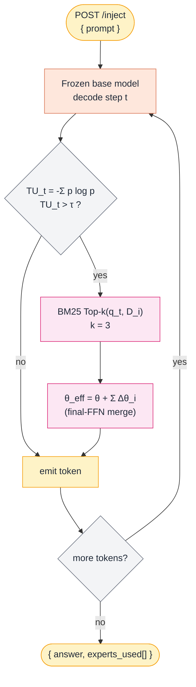

# Components — Deep Dive

Every component is a separate Docker container that runs alongside the others
on a shared bridge network (`loomnet`). This document describes each one in
the form: **what it is, what it owns, what it must never do, how it talks,
and how to extend it**.

> **Convention.** Internal hostname = service name in `docker-compose.yml`.
> Internal port = `8000` for every FastAPI app. Host port mapping is set in
> `.env`.

---

## 🧠 claude-gateway — Brain

### What it is
A FastAPI sidecar around an LLM (Anthropic by default). The only place in
the system that performs *reasoning*.

| Property | Value |
|---|---|
| Base image | `python:3.12-slim` |
| Internal port | `8000` |
| Default host port | `8001` |
| Restart policy | `unless-stopped` |
| Healthcheck | `GET /health` every 10 s |

### What it owns
- Decomposing `user_intent` into a structured `plan` of steps
- Merging memory hits into a final SOP-aware plan
- Synthesising step results into a final report artifact

### What it must never do
- Make HTTP calls to user-facing services (no scraping, no API calls)
- Touch the filesystem outside `/tmp`
- Hold long-running state — every request is stateless

### Endpoints

| Method | Path | Purpose |
|---|---|---|
| `GET` | `/health` | Liveness + stub-mode flag |
| `POST` | `/plan` | Decompose intent into plan JSON |
| `POST` | `/merge` | Fold memory hits into a plan (returns v2) |
| `POST` | `/synthesize` | Produce final report artifact |

Full request/response shapes: [`api-contract.md`](api-contract.md).

### Environment

| Var | Required | Default | Notes |
|---|---|---|---|
| `STUB_MODE` | yes | `1` | `1` = canned JSON, `0` = real Anthropic call |
| `ANTHROPIC_API_KEY` | only when `STUB_MODE=0` | — | Bearer token |
| `CLAUDE_MODEL` | no | `claude-sonnet-4-20250514` | Override per request via header |
| `INTERNAL_API_TOKEN` | no | — | If set, every request needs `Authorization: Bearer …` |
| `REDIS_URL` | yes | `redis://:…@redis:6379/0` | For per-job budget guards |
| `LOG_LEVEL` | no | `INFO` | Python logging level |

### How to extend
- **Swap LLM provider.** Replace the `if not STUB_MODE` block in
  `services/claude-gateway/app/main.py` with the SDK of your choice. Keep
  the response schema identical so n8n doesn't change.
- **Multi-model routing.** Add a `model_id` header path; map header → SDK.
- **Tool-use planning.** Use Anthropic *tool use* to force structured JSON
  output instead of regex-parsing free-form text.

---

## ✋ openclaw — Hands

### What it is
The single executor for every side-effecting step in a plan. It is
deliberately dumb — it does not think; it runs one tool with one input and
returns one structured result.

| Property | Value |
|---|---|
| Base image | `python:3.12-slim` |
| Internal port | `8000` |
| Default host port | `8002` |
| Restart policy | `unless-stopped` |
| Healthcheck | `GET /health` every 10 s |

### What it owns
- A registry of available tools (`web.fetch`, `browser.action`, `shell.run`,
  `api.call` out of the box)
- Tool dispatch + timeout + structured error reporting
- Artifact uploads (screenshots, JSON dumps, logs)

### What it must never do
- Decide *which* tool to use for an unknown step (that's Claude's job)
- Self-retry on failure (n8n owns retry policy)
- Execute tools not in the registry

### Endpoints

| Method | Path | Purpose |
|---|---|---|
| `GET` | `/health` | Liveness |
| `GET` | `/tools` | Tool catalogue manifest (consumed by Claude planner) |
| `POST` | `/execute` | Run one tool invocation |

### Environment

| Var | Required | Default | Notes |
|---|---|---|---|
| `STUB_MODE` | yes | `1` | `1` = canned outputs, `0` = real tool execution |
| `INTERNAL_API_TOKEN` | no | — | Same auth scheme as other services |
| `REDIS_URL` | yes | `redis://:…@redis:6379/0` | Reads upstream step results via `context_keys` |
| `LOG_LEVEL` | no | `INFO` | |

### How to extend
- **Add a tool.** Append to `TOOL_CATALOG` in `app/main.py`, add a handler
  branch in `/execute`, optionally publish a JSON Schema to
  `schemas/<tool>_input.json`.
- **Plug Playwright.** Replace the `browser.action` stub with a Playwright
  call; add Chromium to the Dockerfile.
- **Sandbox shell.** Run `shell.run` inside an inner container (`docker run
  --rm`) or wrap with `firejail` for hardening.

---

## 📚 hermes — Memory

### What it is
Long-term memory store. Two memory kinds live here: **episodic** (what
happened on past jobs) and **SOP** (distilled procedures).

| Property | Value |
|---|---|
| Base image | `python:3.12-slim` (with `libpq5` for psycopg) |
| Internal port | `8000` |
| Default host port | `8003` |
| Restart policy | `unless-stopped` |
| Healthcheck | `GET /health` (includes DB ping) |

### What it owns
- Vector + keyword search over `episodic_memory` and `sop` tables
- Persisting new episodes after every job
- Bumping SOP versions when Claude proposes patches

### What it must never do
- Initiate actions (it's pulled, never pushes)
- Block the pipeline — `/recall` is degradable; if Postgres is down,
  return empty hits and let the rest of the run proceed

### Endpoints

| Method | Path | Purpose |
|---|---|---|
| `GET` | `/health` | Liveness + DB ping |
| `POST` | `/recall` | Top-K SOP / episodic hits for a query |
| `POST` | `/write` | Persist episodic + SOP updates |

### Environment

| Var | Required | Default | Notes |
|---|---|---|---|
| `STUB_MODE` | yes | `1` | Currently unused; reserved for future embedding-stub mode |
| `INTERNAL_API_TOKEN` | no | — | Same auth scheme |
| `DATABASE_URL` | yes | `postgresql://…@postgres:5432/hermes` | Connection string |
| `LOG_LEVEL` | no | `INFO` | |

### Schema

```sql
CREATE TABLE episodic_memory (
    id           TEXT PRIMARY KEY,
    job_id       TEXT NOT NULL,
    intent       TEXT NOT NULL,
    outcome      TEXT NOT NULL,        -- success | failed | partial | success_after_retry
    summary      TEXT NOT NULL,
    embedding    vector(1536),
    metadata     JSONB DEFAULT '{}',
    created_at   TIMESTAMPTZ DEFAULT now()
);

CREATE TABLE sop (
    id            TEXT NOT NULL,
    version       INT  NOT NULL,
    title         TEXT NOT NULL,
    content_md    TEXT NOT NULL,
    embedding     vector(1536),
    applied_count INT DEFAULT 0,
    success_rate  NUMERIC(4,3),
    created_at    TIMESTAMPTZ DEFAULT now(),
    PRIMARY KEY (id, version)
);
```

### How to extend
- **Real embeddings.** Replace the constant `score = 0.85` in `/recall` with
  `1 - (embedding <=> query_embedding)`. Compute query embedding via your
  provider of choice.
- **Tenant isolation.** Add `tenant_id TEXT NOT NULL` to both tables and a
  filter to every query.
- **SOP from Git.** Mount a Git-tracked SOP directory and have Hermes pull
  on every recall.

---

## 🧩 hermes-dmoe — Knowledge (DMoE)

### What it is
An **optional** sibling to `hermes` that injects knowledge at the **parameter
level** instead of the prompt level, using **Decoupled Mixture-of-Experts**
([arXiv:2606.14243](https://arxiv.org/abs/2606.14243); local copy in
[`references/DMoE-2606.14243v1.pdf`](references/DMoE-2606.14243v1.pdf)). It runs
its own **self-hosted open base model** plus a bank of independently-trained
LoRA experts, and answers knowledge-heavy sub-prompts that the closed-API Brain
cannot be fine-tuned for.

| Property | Value |
|---|---|
| Base image | `nvidia/cuda:12.x` + Python 3.12 + FastAPI + vLLM/PEFT |
| Internal port | `8000` |
| Default host port | `8004` |
| Restart policy | `unless-stopped` |
| Healthcheck | `GET /health` (includes base-model + index ping) |
| Hardware | 1 GPU (paper runs Llama-3.2-1B / Qwen2.5-1.5B in ~7–8 GB) |

### What it owns
- A **frozen** self-hosted base model for autoregressive decoding
- An **expert bank** of LoRA deltas `Δθ_i`, one per knowledge unit, each
  ~123K params (~481 KiB on disk), attached **only to the final-layer FFN**
- A **training-free BM25 router** over each expert's text surrogate `D_i`
- **Uncertainty-gated** expert activation and hot LoRA merge during decoding

### What it must never do
- Plan or pick tools (that's the Brain) — it only answers / completes prompts
- Perform side-effecting I/O (no web, shell, or API calls)
- Store regulated/PHI knowledge as baked experts (keep that in `hermes`)
- Self-retry (n8n owns retry policy)

### Inference flow



### Endpoints

| Method | Path | Purpose |
|---|---|---|
| `GET` | `/health` | Liveness + base-model + expert-index status |
| `GET` | `/experts` | Expert-bank stats (count, base model, index size) |
| `POST` | `/inject` | Uncertainty-gated DMoE generation for a prompt |
| `POST` | `/experts/upsert` | Add/update an expert (LoRA Δθ + surrogate `D_i`) |
| `DELETE` | `/experts/{id}` | Remove one expert (drops index entry + adapter) |

Full request/response shapes: [`api-contract.md`](api-contract.md#knowledge--hermes-dmoe-port-8004).

### Environment

| Var | Required | Default | Notes |
|---|---|---|---|
| `STUB_MODE` | yes | `1` | `1` = echo + canned experts; `0` = real base model + LoRA merge |
| `BASE_MODEL` | when `STUB_MODE=0` | `meta-llama/Llama-3.2-1B-Instruct` | Self-hosted open base |
| `EXPERT_BANK_DIR` | yes | `/data/experts` | LoRA adapters + BM25 index volume |
| `TU_THRESHOLD` | no | `2.0` | Token-entropy trigger `τ` |
| `TOP_K` | no | `3` | Experts merged per trigger |
| `INTERNAL_API_TOKEN` | no | — | Same auth scheme as other services |
| `LOG_LEVEL` | no | `INFO` | |

### How to extend
- **Build experts.** For each knowledge unit: 1 paraphrase + 3 generated Q&A
  pairs → train a LoRA adapter (rank 4, α = 16, lr 1e-5, 1 epoch, base frozen),
  store `Δθ_i` + surrogate `D_i`, insert `D_i` into the BM25 index.
- **Swap the router.** BM25 is the default (training-free, robust). A dense
  retriever (e.g. SGPT) can improve some datasets at ~0.6 GB more GPU.
- **Tune the trade-off.** Raise `TU_THRESHOLD` to route less often (faster);
  lower it for more aggressive injection.
- **Wire into the loom.** Add an n8n `IF` ("domain knowledge?") after
  `Hermes /recall` that routes knowledge-heavy jobs through `POST /inject`
  before `Claude /merge`. On the 3-VM hybrid topology `hermes-dmoe` is co-located
  with `hermes` on **VM-3** (native systemd, GPU-equipped); point the n8n HTTP
  node at VM-3's Tailscale IP on port `8004`.

---

## 🚌 redis — State Bus

### What it is
The agent backplane for **in-flight** job state. Distinct from `postgres`,
which holds long-term memory.

| Property | Value |
|---|---|
| Image | `redis:7-alpine` |
| Port | `6379` |
| Persistence | AOF (`appendonly yes`) — survives restarts |

### What it owns
- Per-job state machine (`job:{id}:state`)
- Step results awaiting aggregation (`job:{id}:step:{step_id}`)
- Distributed locks for retry safety (`job:{id}:lock`)
- Per-job token budget counters (`job:{id}:budget`)

### Key conventions

| Key pattern | Type | Purpose | TTL |
|---|---|---|---|
| `job:{id}:state` | string | one of `Received` / `Planning` / `Executing` / `Done` / `Failed` | 7 d |
| `job:{id}:plan` | json | Final merged plan | 7 d |
| `job:{id}:step:{step_id}` | json | Result of a single step | 7 d |
| `job:{id}:cursor` | int | Index of next step to execute | 7 d |
| `job:{id}:lock` | string | `SET NX PX 30000` for distributed lock | 30 s |
| `job:{id}:budget` | int | tokens consumed; checked by Claude Gateway | 7 d |

### How to extend
- **Cluster.** Move to Redis Sentinel or Cluster for HA.
- **Streams.** Replace ad-hoc keys with `XADD` to a stream per job for full
  auditability + replay.

---

## 🗄 postgres — Long-term Storage

### What it is
The only **durable** component in the stack. Every successful job writes
here. SOPs version up here.

| Property | Value |
|---|---|
| Image | `pgvector/pgvector:pg16` |
| Port | `5432` |
| Volume | `postgres-data` |

### Bootstrapping
On first boot, `infra/postgres/init.sql` is executed automatically (Postgres
runs anything in `/docker-entrypoint-initdb.d/` once). It creates the
extensions, tables, and seeds one SOP so the system has data on day 1.

### Backups
Snapshot the `postgres-data` Docker volume nightly:
```bash
docker run --rm -v gateforge-loom_postgres-data:/src -v $PWD:/dst \
  alpine tar czf /dst/postgres-$(date +%F).tgz -C /src .
```
Or use `pg_dump` from the running container:
```bash
docker exec gfl-postgres pg_dump -U hermes hermes > hermes-$(date +%F).sql
```

---

## 🎼 n8n — Orchestrator

### What it is
The control-flow brain of the entire system. It is **not** an agent — it
is the conductor that decides which agent to call when. Everything
deterministic (sequencing, fan-out, retry, output sinks) lives here.

| Property | Value |
|---|---|
| Image | `n8nio/n8n:latest` |
| Port | `5678` |
| Volume | `n8n-data` (workflow + credential storage) |
| Read-only mount | `./n8n/workflows:/workflows` |

### What it owns
- Workflow execution (one workflow per task type)
- HTTP retries with backoff
- Webhook ingress + scheduled triggers
- Output sinks (Notion, Slack, Drive, Webhook)

### What it must never do
- Embed business logic that should live in an agent. If you find yourself
  writing 50+ lines of JS in a Code node, that logic belongs in a new
  service.

### Critical environment vars

| Var | Why |
|---|---|
| `N8N_ENCRYPTION_KEY` | **MUST** be 32 random chars and stable across restarts; encrypts stored credentials |
| `N8N_BASIC_AUTH_*` | Protect the UI in any environment exposed to a network |
| `WEBHOOK_URL` | Public URL n8n uses to construct webhook URLs |
| `GENERIC_TIMEZONE` | We use `Asia/Hong_Kong` |

### How to extend
- **Add an output sink.** Drop a Notion / Slack / Google Drive node after
  `Claude /synthesize`.
- **Schedule a job.** Replace the Webhook trigger with a Cron trigger for
  recurring runs (weekly competitor analysis, daily KPI report, etc.).
- **Approve gate.** Add an `IF` + `Wait` node before the Output sink for
  human-in-the-loop runs.

---

## Cross-cutting concerns

### Auth
All inter-service HTTP traffic uses a single shared bearer token
(`INTERNAL_API_TOKEN`) for the PoC. In production:

- Issue per-service tokens.
- Front everything with mTLS via a service mesh (Linkerd/Istio) or wrap in
  Tailscale ACLs.
- Never expose ports 8001-8003 publicly.

### Observability
Each agent emits standard `logging` records to stdout. Recommended for
production:

- Aggregate logs with **Loki** + **Grafana**.
- Add OpenTelemetry tracing with `job_id` as the trace ID. Export to
  **Tempo** or **Honeycomb**.
- Healthchecks already exist on every container — wire **uptime-kuma** for
  alerting.

### Cost guardrails
The Claude Gateway reads `job:{id}:budget` from Redis before every LLM call.
If the counter exceeds a configurable cap, the request returns
`status_code=402` and the job is marked `Failed`. Better to fail loudly
than burn a credit card.
